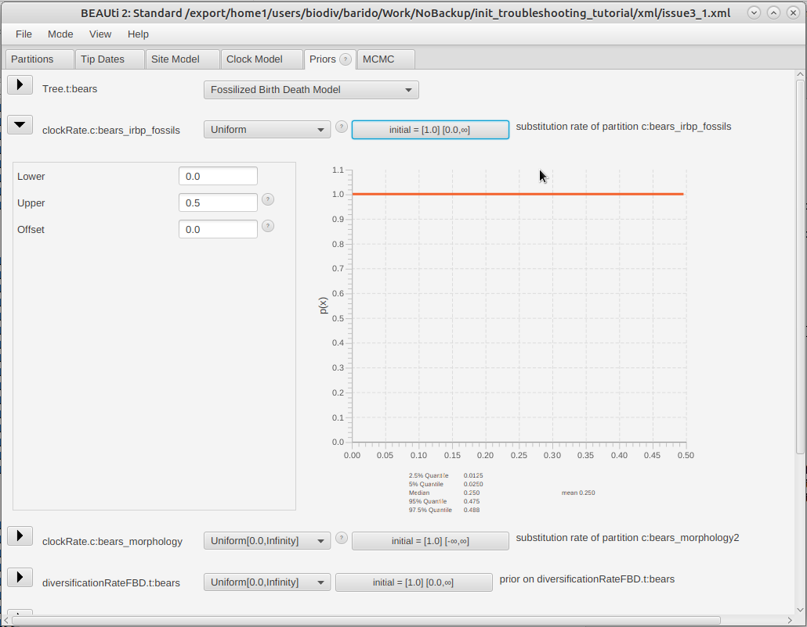

# Background

Many different problems can prevent a BEAST2 analysis from starting, from technical and file issues to incompatibilities in the model setup. In this tutorial, we will show examples of common issues and learn how to diagnose and fix them.

----

# Programs used in this Exercise 

### BEAST2 - Bayesian Evolutionary Analysis Sampling Trees 2

BEAST2 ([http://www.beast2.org](http://www.beast2.org)) is a free software package for Bayesian evolutionary analysis of molecular sequences using MCMC and strictly oriented toward inference using rooted, time-measured phylogenetic trees. This tutorial is written for BEAST v{{ page.beastversion }} . 


### BEAUti2 - Bayesian Evolutionary Analysis Utility

BEAUti2 is a graphical user interface tool for generating BEAST2 XML configuration files.

Both BEAST2 and BEAUti2 are Java programs, which means that the exact same code runs on all platforms. For us it simply means that the interface will be the same on all platforms. The screenshots used in this tutorial are taken on a Mac OS X computer; however, both programs will have the same layout and functionality on both Windows and Linux. BEAUti2 is provided as a part of the BEAST2 package so you do not need to install it separately.

### Text editor

We will perform some manual edits on the XML files in this tutorial. XML files can be open by any text editor, but it may be more comfortable to work with an editor designed for the XML format. Some good examples are Notepad++ (Windows), Sublime Text (Mac), EMACS (any platform) or VSCode (any platform), but you can use whichever program you prefer.

----

# Practical: Troubleshooting initialization issues

## The Data

The data used in this tutorial is an alignment of molecular sequences for the interphotoreceptor retinoid-binding protein (irbp), and a morphological character matrix. Both alignments contain data for 8 extant and 14 fossil bear species.

 
## Packages

Examples in this tutorial require the SA (Sampled Ancestors) package to be installed.

> Launch **BEAUti**, then open the **BEAST2 Package Manager** by navigating to **File > Manage Packages**. ([Figure 1](#packageManage1))
> 

<figure>
	<a id="packageManage1"></a>
	
	<figcaption>Figure 1: Finding the BEAST2 Package Manager.</figcaption>
</figure>
<br>

The SA package may already be installed, as in BEAST 2.7 it is often installed by default. Otherwise, install it by doing the following:

> Install the **SA** package by selecting it and clicking the **Install/Upgrade** button. ([Figure 2](#packageSA))
> 

<figure>
	<a id="packageSA"></a>
	
	<figcaption>Figure 2: The SA package.</figcaption>
</figure>
<br>

> Uninstall the **MM** package by selecting it and clicking the **Uninstall** button. ([Figure 3](#packageMM))
> 

<figure>
	<a id="packageMM"></a>
	
	<figcaption>Figure 3: The MM package.</figcaption>
</figure>
<br>

BEAUti needs to be closed for the newly installed packages to be loaded properly.

> Close the **BEAST2 Package Manager** and **BEAUti**.
> 


## Common issue #1: Class could not be found

> Download the BEAST2 input file `issue1.xml`.
> Open **BEAST2** and select the file `issue1.xml` as input file. Start the run with the **Run** button.
> You should get an error message, as shown in [Figure 4](#errorPackage).
>

<figure>
	<a id="errorPackage"></a>
	
	<figcaption>Figure 4: An error message in BEAST2.</figcaption>
</figure>
<br>


This error means that BEAST2 could not identify one of the components of the analysis in the XML. The error message shows which component is unidentified, in this example _morphmodels.evolution.substitutionmodel.LewisMK_, as well as the program's closest guess for what the component could be, here _beastlabs.inference.ML_. There are two main causes of this problem:

- an error was introduced in the component name when editing the XML manually. In this case, you simply need to edit the XML to use the correct name.
- BEAST2 is missing the package which contains this component. In this case, you need to identify which package is missing. If the file was produced by BEAUti, it should contain a list of required packages in the first line of the file. Otherwise you can try examining the source of the XML (e.g. a tutorial or a published analysis) or searching online for the name of the missing component.

In this example, we have not edited the XML manually, so we conclude that we are missing a package. From the first line of the XML, we can see the list of required packages 
```xml 
required="BEAST.base v2.7.4:SA v2.1.1:MM v1.2.1" 
```
Thus we are missing the **MM** package which contains the morphological substitution models (as we could also see from the name of the missing component).

> Following the same process as for the **SA** package, open the **BEAST2 Package Manager** in **BEAUti** and install the **MM** package.
> Run the file `issue1.xml` in **BEAST2** again, and check that it now works.
>


## Common issue #2

> Download the BEAST2 input file `issue2.xml` in the same folder as `issue`1`.xml`.
> Open **BEAST2** and select the file `issue2.xml` as input file. Start the run with the **Run** button.
> You should get an error message, as shown in [Figure 5](#errorOverwrite).
>

<figure>
	<a id="errorOverwrite"></a>
	
	<figcaption>Figure 5: Another error message in BEAST2.</figcaption>
</figure>
<br>

This error means that BEAST2 is attempting to overwrite a log or tree file that already exists, as explained in the message _Trying to write file bears.log but the file already exists._. By default, overwriting files is not permitted in order to avoid accidentally losing data. If **BEAST2** is run in interactive mode, for instance on your local machine, it offers you the possibility to continue the analysis, by typing **Y** to overwrite the files. However, if **BEAST2** is run on a cluster, it will simply stop when encountering this issue.
To solve this problem, there are three possibilities:

- if the intention is to overwrite the existing files, select the **overwrite** option in the **BEAST2** launcher (see [Figure 6](#overwrite)) or use the **-overwrite** option in the command-line interface.

<figure>
	<a id="overwrite"></a>
	
	<figcaption>Figure 6: BEAST2 launcher with overwrite option.</figcaption>
</figure>
<br>

- if the intention is to resume a run, i.e. to append to the existing files, select the **resume** option in the **BEAST2** launcher (see [Figure 7](#resume)) or use the **-resume** option in the command-line interface.

<figure>
	<a id="resume"></a>
	
	<figcaption>Figure 7: BEAST2 launcher with resume option.</figcaption>
</figure>
<br>

- if you would like to create new files, either move the original files or change the names of the log and tree files in the new analysis.

> Open **BEAUti** and load the file `issue2.xml`.
> In the **MCMC** panel, expand the options for the **tracelog** by clicking on the arrow to the left. Change the **File Name** to **bears_longer.log**.
> Do the same for the **treelog** and change the **File Name** to **bears_longer.trees**.
> Save the file `issue2.xml`. Run it in **BEAST2** again, and check that it now works.
>


## Common issue #3: Could not find a proper state to initialize

### Troubleshooting a parameter issue

> Download the BEAST input file `issue3_1.xml`.
> Open **BEAST2** and select the file `issue3_1.xml` as input file. Start the run with the **Run** button.
> You should get an error message, as shown in [Figure 8](#errorStarting).
> 

<figure>
	<a id="errorStarting"></a>
	
	<figcaption>Figure 8: Yet another error message in BEAST2.</figcaption>
</figure>
<br>

In this situation, the inference failed to start because a good initial state could not be found, as explained by the error message (_Fatal exception: Could not find a proper state to initialise._). This issue is much more complex to diagnose than the previous ones, as it can be caused by many different parts of the analysis configuration. However, as before the error message provides some information on the source of the problem, as it details the probability of all the components of the analysis. Here the message reads _P(ClockPrior.c:bears_irbp_fossils) = -Infinity_, showing that the issue is likely linked to the clock rate of the molecular alignment and the prior set on this parameter.

To inspect the parameter and find the issue, we will first load the file into BEAUti.

> Open **BEAUti** and load in the `issue3_1.xml` file by navigating to **File > Load**.
> Switch to the **Priors** panel.
> Click on the arrow left of the **clockRate.c:bears_irbp_fossils** to see the details of this prior ([Figure 9](#clockRatePrior)).
>

<figure>
	<a id="clockRatePrior"></a>
	
	<figcaption>Figure 9: Details of the clock rate prior.</figcaption>
</figure>
<br>

We can see that the clock rate prior was changed from the default, which is a uniform distribution from 0 to infinity, to a uniform distribution from 0 to 0.5. In general, changing this default prior is a good idea, as the default is extremely vague and very unlikely to be accurate. However, if we set a more narrow distribution we need to make sure that the starting value for the parameter is still within the range of the chosen distribution. For each parameter, the starting value is shown in the box to the right, as **initial = [x] [min, max]** ([Figure 10](#initialVal)). Here _x_ indicates the starting value and _min_ and _max_ the range of possible values for the corresponding parameter.

<figure>
	<a id="initialVal"></a>
	
	<figcaption>Figure 10: Initial values in the Priors panel.</figcaption>
</figure>
<br>

> Check the initial value of the **clockRate.c:bears_irbp_fossils** parameter in the box to the right of the parameter.
> We can see that the box reads **initial = [1.0]**.
>

The initial value of the clock rate is thus set to **1.0**, which is outside the bounds of the chosen prior for this parameter. This is why the initialization failed.

> In the **Priors** panel, click on the **initial = [1.0]** box right of the **clockRate.c:bears_irbp_fossils** parameter.
> Change the initial value in the **Value** box to **0.01** ([Figure 11](#initialClock)).
> Click on **OK** to close the box.
> Save the updated configuration as `issue3_1_fixed.xml` by navigating to **File > Save As**.>
> Open **BEAST2** and select `issue3_1_fixed.xml` as the input file.
> Start the run with the **Run** button. It works now!
>

<figure>
	<a id="initialClock"></a>
	
	<figcaption>Figure 11: Changing the initial value of the clock rate.</figcaption>
</figure>
<br>


### Troubleshooting a model issue

> Download the BEAST input file `issue3_2.xml`.
> Open **BEAST2** and select the file `issue3_2.xml` as input file. Start the run with the **Run** button.
> You should get an error message, as shown in [Figure 12](#errorStarting2).
> 

<figure>
	<a id="errorStarting2"></a>
	
	<figcaption>Figure 12: A similar error message as earlier.</figcaption>
</figure>
<br>

As in the previous section, **BEAST2** could not find a valid state to start the inference. This time the message reads _P(FBD.t:bears) = -Infinity_, showing that the issue likely appears in the calculation of the FBD likelihood. The FBD prior is a tree prior, and depends on the tree as well as several other parameters, so there are several possible causes for the calculation issue:

-  a bug in the likelihood calculation itself: BEAST2 packages can contain calculation issues which have been undetected so far (especially if they only appear in very specific circumstances), in which case they should be reported to the development team. However, this is unlikely in our case, as the FBD model has been extensively used without issue in previous analyses, and our analysis setup is similar to previous analyses.
-  an issue with the initial tree: the inference will not start if the provided initial tree is impossible under the specified tree model or doesn't match with the provided MRCA constraints. By default, most analyses use a random tree simulated by the inference, which will fulfill all constraints. However, with more complex models or constraints, the simulation process can fail to find a good tree, in which case a valid starting tree needs to be provided by the user.
-  an issue with the initial values of the parameters: if the initial values set in the analysis are very far from plausible, the resulting likelihood of the model will be extremely small, which gets recorded as _-Infinity_ by BEAST2.

To inspect the starting values and find the issue, we will first load the file into BEAUti.

> Open **BEAUti** and load in the `issue3_2.xml` file by navigating to **File > Load**.
> 

The starting tree can be found in the **Starting tree** panel, which is hidden by default.

> Open the **Starting tree** panel by navigating to **View > Show Starting tree panel**.
> Switch to the **Starting tree** panel.
>

<figure>
	<a id="startingTree"></a>
	
	<figcaption>Figure 13: Starting tree panel.</figcaption>
</figure>
<br>

As we can see in [Figure 13](#startingTree), the initial tree in this analysis is set to a Newick tree, chosen by the user. The **Newick** box gives the full Newick string, which we could use to inspect the tree in an other program. This string can also be copied directly from the XML file. First, we will check if this tree is compatible with the tree constraints set in the **Priors** panel.

> Switch to the **Priors** panel.
> Click on the arrow left of the **root.prior** to see the details of this prior ([Figure 14](#rootPrior)).
>

<figure>
	<a id="rootPrior"></a>
	
	<figcaption>Figure 14: Priors panel showing the root prior.</figcaption>
</figure>
<br>

The only constraint set on the tree is a prior on the age of the root, which we can see in the **Priors** panel. By checking the details, we can see that this is a wide lognormal prior, with the 5% quantile of the prior at 206 Ma and the 95% quantile at 437 Ma. Let's import our starting tree in Icytree to check if the root age is compatible with the prior.

> Open Icytree ([https://icytree.org/](https://icytree.org/)) in a web browser.
> Copy the Newick string from the **Starting tree** panel or from the XML file.
> Paste the string into a blank text file and save it as `starting.tre`.
> Drag and drop the `starting.tre` file into Icytree.
>

By hovering over the root node of the starting tree, we can see that its age is set to **417.2 Ma**, which is consistent with the root prior set in the analysis. 

Next, we will inspect the starting values of the parameters of the FBD model, found in the **Priors** panel in **BEAUti**. The FBD model has 3 parameters: the diversification rate, the turnover and the sampling proportion. We can see that the initial diversification rate is **1.0**, the initial sampling proportion is **0.5** and the initial turnover is **0.5**. These are the default values for these parameters, but they may not be adapted to all datasets. In particular, a diversification rate of 1.0/My is a very high value - since our starting tree is 400 My old, it means that we would expect about **exp(400 x 1.0) = 5 x 10^173** extant species (as opposed 8 extant bears). Having a very implausible starting value for the diversification rate could explain the failure we observed earlier when calculating the likelihood of the FBD model, so we will change it to a more realistic value of **0.01**.


> In the **Priors** panel, click on the **initial = [1.0]** box right of the **diversificationRateFBD** parameter.
> Change the initial value in the **Value** box to **0.01** ([Figure 15](#initialDiv)).
> Click on **OK** to close the box.
> Save the updated configuration as `issue3_2_fixed.xml` by navigating to **File > Save As**.
> Open **BEAST2** and select `issue3_2_fixed.xml` as the input file.
> Start the run with the **Run** button. It works now!
>

<figure>
	<a id="initialDiv"></a>
	
	<figcaption>Figure 15: Changing the initial value of the diversification rate.</figcaption>
</figure>
<br>


### Increasing the number of initialization attempts

If there is no obvious incompatibility in the setup of the analysis, it is possible that the problem is simply due to bad luck rather than a fundamental problem in the analysis. This is rare, but it can happen with complex configurations or with packages and models which are still under development. By default, **BEAST2** will try to initialize the analysis **10** times before giving up, but it is possible to increase the number of attempts.

> Open **BEAUti** and load in the `issue3_1.xml` file by navigating to **File > Load**.
> Switch to the **MCMC** tab.
> The number of initialization attempts is controlled by the **Num Initialization Attempts** setting, shown in [Figure 16](#numInit).
>

<figure>
	<a id="numInit"></a>
	
	<figcaption>Figure 16: Setting the number of initialization attempts.</figcaption>
</figure>
<br>

Note that changing this setting will never help if the analysis contains incompatibilities. In the case of the `issue3_1.xml` file, for instance, the starting value of the clock rate is outside of the bounds of the corresponding prior, so initialization will always fail regardless of how many attempts are performed.


## Common issue #4: Validation error when initializing object

> Download the BEAST input file `issue4.xml` and `issue4_working.xml`.
> Open **BEAST2** and select the file `issue4.xml` as input file. Start the run with the **Run** button.
> You should get an error message, as shown in [Figure 17](#errorParsing).
>

<figure>
	<a id="errorParsing"></a>
	
	<figcaption>Figure 17: The return of the error message.</figcaption>
</figure>
<br>

Here the run failed to start because the XML configuration file could not be parsed, as explained by the error message _Error 110 parsing the xml input file_. Thankfully the error message tells us exactly where the error happened (_<log id='ORCRatesStat.c:bears_morphology' spec='beast.base.evolution.RateStatistic'>_) and what is the issue (_Input 'tree' must be specified._). If we open the `issue5.xml` file and look for **ORCRatesStat.c:bears_morphology**, we can see that line 771 corresponds to the error message and reads as follows:
```xml
	<log id="ORCRatesStat.c:bears_morphology" spec="beast.base.evolution.RateStatistic" branchratemodel="@OptimisedRelaxedClock.c:bears_morphology"/>
```
By comparing to a previous (working) analysis in the file `issue4_working.xml`, we can see that the correct configuration should be (line 733):
```xml
	<log id="ORCRatesStat.c:bears_morphology" spec="beast.base.evolution.RateStatistic" branchratemodel="@OptimisedRelaxedClock.c:bears_morphology" tree="@Tree.t:bears"/>
```
As the error message told us, the **tree** element of the configuration is missing in the non-working XML file, so we need to add it back in.

> Open the file `issue4.xml` in a text editor.
> Modify **line 771** of the file to add the **tree="@Tree.t:bears"** element. Save the file as `issue4_fixed.xml`.
> Open **BEAST2** and select the file `issue4_fixed.xml` as input file. Start the run with the **Run** button.
> Now it works!
>

XML parsing errors usually occur when the XML file has been manually edited and parts of the configuration have been accidentally deleted or modified. This is why it's important to always keep a copy of the original XML when making manual edits, as this provides an easy way to check the correct configuration. Loading, saving and re-loading complex configurations into BEAUti repeatedly can also lead to parsing issues, although this is a bug and should be reported to the development team if it happens (for instance by opening an issue on [https://github.com/CompEvol/BeastFX/issues](https://github.com/CompEvol/BeastFX/issues). In general, if an XML parsing error occurs in a file which was generated entirely through BEAUti, then this bug should be reported to the development team.


## Error messages not covered in this tutorial

Many different issues can occur in **BEAST2**, and it is impossible to cover them all in this tutorial. However, one important thing to keep in mind is that **BEAST2** will always attempt to provide as much information as possible on the issue it has encountered. Thus it is critical to carefully read the error messages, as in the following example.

> Download the BEAST2 input file `issue5.xml`.
> Open **BEAST2** and select the file `issue5.xml` as input file. Start the run with the **Run** button.
> You should get an error message, as shown in [Figure 18](#errorOrigin).
>

<figure>
	<a id="errorOrigin"></a>
	
	<figcaption>Figure 18: The revenge of the return of the error message.</figcaption>
</figure>
<br>

Here the message (_Initial value of origin (100.0) should be greater than initial root height (125.1)_) indicates clearly what is going on: we have specified an origin parameter with an initial value which is incompatible with the initial tree. Unfortunately, this error also means that the file cannot be loaded in **BEAUti** (although it was produced by it originally).

> Open the `issue5.xml` file in a text editor.
> Look for the parameter **originFBD.t:bears** and examine its initial value.
> Look for the root prior **root.prior** and examine its distribution. Look in particular at the values for the **offset**, **M** and **S** parameters.
>

The origin parameter configuration is:
```xml
	<parameter id="originFBD.t:bears" spec="parameter.RealParameter" lower="0.0" name="stateNode">100.0</parameter>
```
And the root prior distribution is set up like this:
```xml
	<LogNormal id="LogNormalDistributionModel.9" name="distr" offset="125.0">                                 
        <parameter id="RealParameter.92" spec="parameter.RealParameter" estimate="false" name="M">2.0</parameter>
        <parameter id="RealParameter.93" spec="parameter.RealParameter" estimate="false" lower="0.0" name="S" upper="5.0">0.5</parameter>
    </LogNormal>
```

We can see that the distribution for the root prior has an offset of **125.0**, meaning that the root of the tree will always be greater than this value. However the initial value of the origin parameter was left to the default, which is **100.0**. This is the source of the error reported by **BEAST2**. Thus we need to change the value of the origin to be compatible with our starting tree.

> In the text editor, look for the parameter **originFBD.t:bears** and change its value from **100.0** to **150.00**.
> Save the updated configuration as `issue5_fixed.xml`.
> Open **BEAST2** and select `issue5_fixed.xml` as the input file.
> Start the run with the **Run** button. It works now!
>

Note that this issue can also happen when using a user-specified starting tree, for instance a tree from a Newick string. In this case the origin parameter needs to be compatible with the specified tree, i.e. the initial value of the origin needs to be higher than the root of the Newick tree.

----

# Acknowledgment

Many examples in this tutorial are inspired by real issues encountered during the analysis of the convergent evolution of true crabs .


# Useful Links

- [Bayesian Evolutionary Analysis with BEAST 2](http://www.beast2.org/book.html) 
- BEAST 2 website and documentation: [http://www.beast2.org/](http://www.beast2.org/)
- BEAST 1 website and documentation: [http://beast.bio.ed.ac.uk](http://beast.bio.ed.ac.uk)
- Join the BEAST user discussion: [http://groups.google.com/group/beast-users](http://groups.google.com/group/beast-users) 

----

# Relevant References



