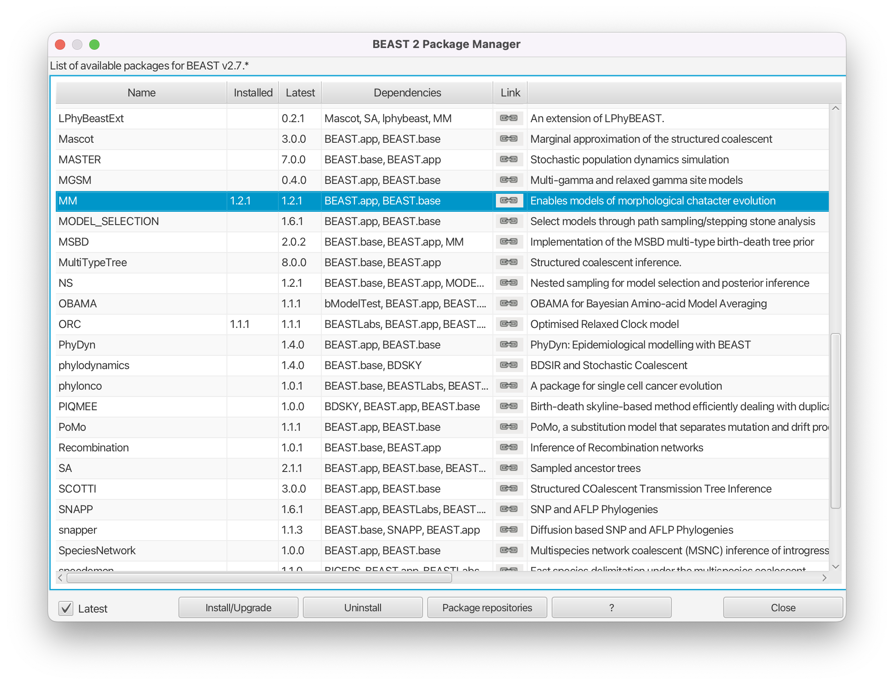
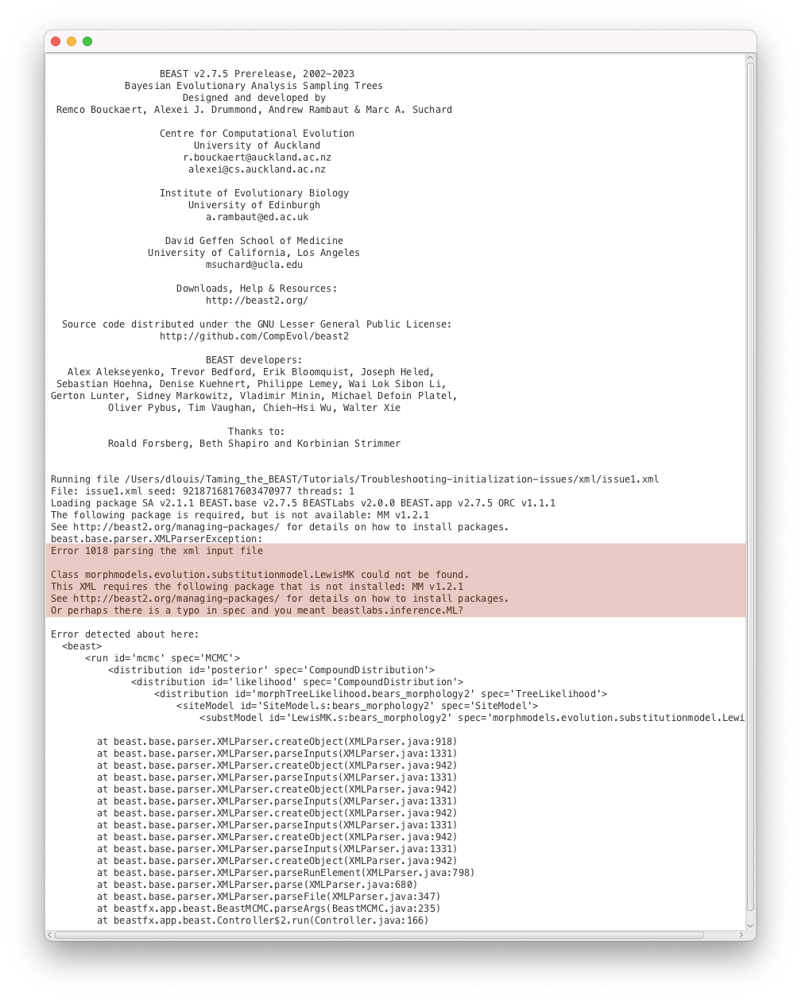
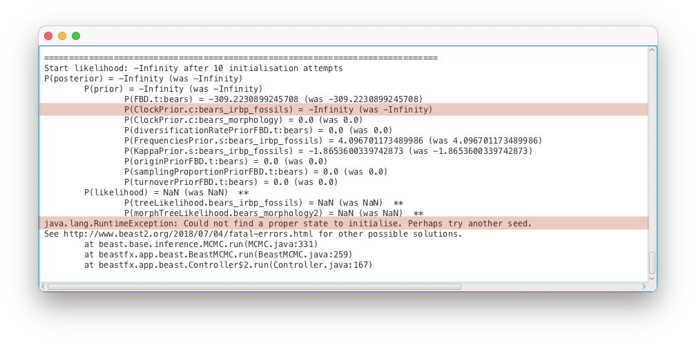
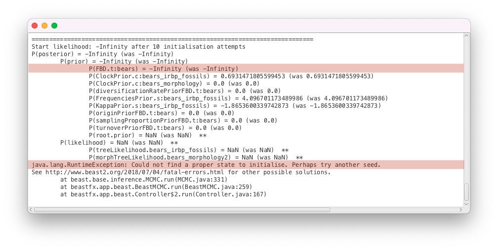
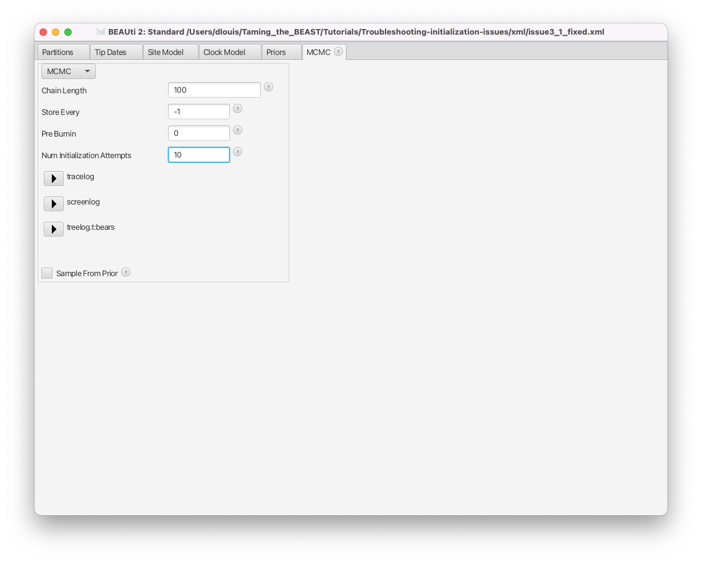
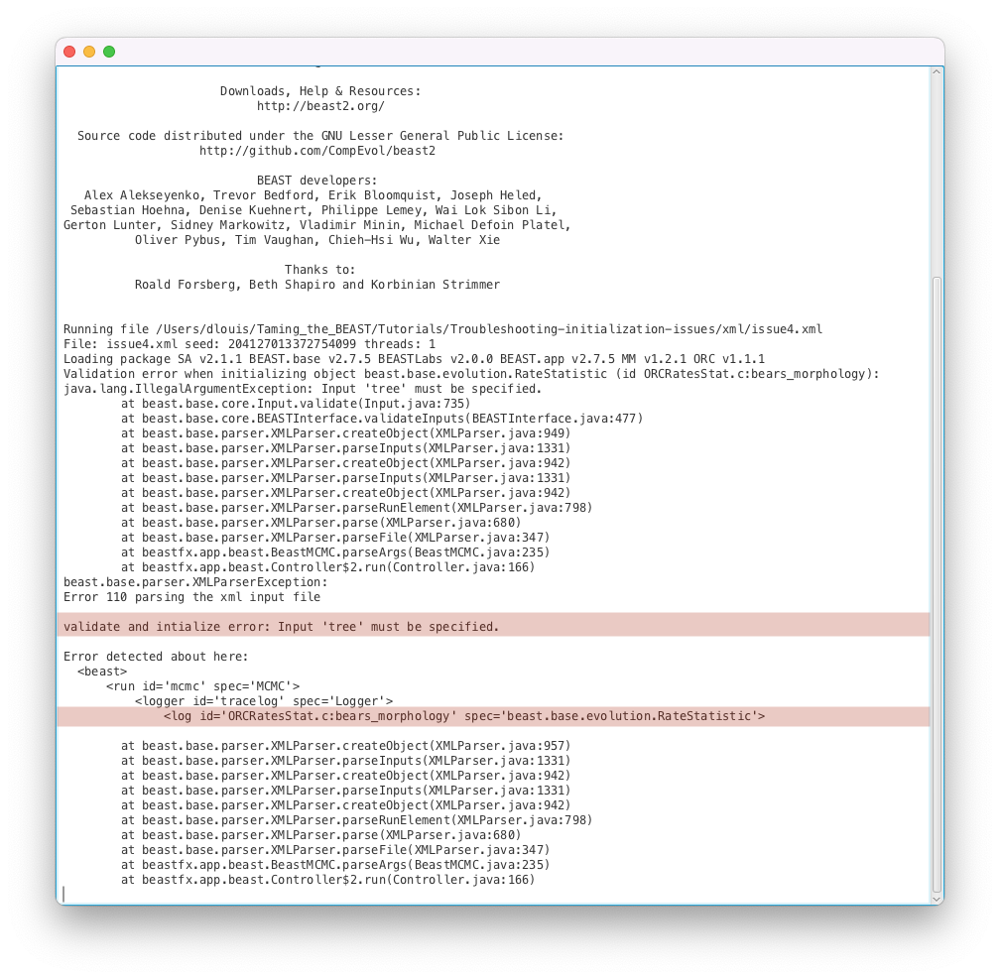

# Background

Many different problems can prevent a BEAST2 analysis from starting, from technical and file issues to incompatibilities in the model setup. In this tutorial, we will show examples of common issues and learn how to diagnose and fix them.

----

# Programs used in this Exercise 

### BEAST2 - Bayesian Evolutionary Analysis Sampling Trees 2

BEAST2 ([http://www.beast2.org](http://www.beast2.org)) is a free software package for Bayesian evolutionary analysis of molecular sequences using MCMC and strictly oriented toward inference using rooted, time-measured phylogenetic trees. This tutorial is written for BEAST v{{ page.beastversion }} . 


### BEAUti2 - Bayesian Evolutionary Analysis Utility

BEAUti2 is a graphical user interface tool for generating BEAST2 XML configuration files.

Both BEAST2 and BEAUti2 are Java programs, which means that the exact same code runs on all platforms. For us it simply means that the interface will be the same on all platforms. The screenshots used in this tutorial are taken on a Mac OS X computer; however, both programs will have the same layout and functionality on both Windows and Linux. BEAUti2 is provided as a part of the BEAST2 package so you do not need to install it separately.


### Any programmer-friendly text editor

We will need to perform some manual edits on the XML files produced by BEAUti, for which we'll need a text editor. XML files can be opened by any text editor, but it's best to use one designed for programmers as these include nice features such as syntax highlighting, which makes the code more reader-friendly. [Sublime Text](https://www.sublimetext.com) is a good option which is available for MacOS, Windows and Linux. Other options include [Notepad++](https://notepad-plus-plus.org) (Windows), [Emacs](https://www.gnu.org/software/emacs/) (any platform) or [VSCode](https://code.visualstudio.com) (any platform). 

----

# Practical: Troubleshooting initialization issues

## The Data

The data used in this tutorial is an alignment of genetic sequences for the interphotoreceptor retinoid-binding protein (irbp), and a morphological character matrix. Both alignments contain data for 8 extant and 14 fossil bear species. To illustrate different issues we have created several XML files using this dataset, each with a different initalization issue, available on the left-hand panel, under the heading **XML**.

 
## Packages

Examples in this tutorial require the **SA** (Sampled Ancestors) package to be installed.

> Launch **BEAUti**, then open the **BEAST2 Package Manager** by navigating to **File > Manage Packages** ([Figure 1](#packageManage1)).
> 

<figure>
	<a id="packageManage1"></a>
	
	<figcaption>Figure 1: Finding the BEAST2 Package Manager.</figcaption>
</figure>
<br>

The **SA** package may already be installed, as in BEAST 2.7 it is often installed by default. Otherwise, install it by doing the following.

> Install the **SA** package by selecting it and clicking the **Install/Upgrade** button ([Figure 2](#packageSA)).
> 

<figure>
	<a id="packageSA"></a>
	
	<figcaption>Figure 2: Install the SA package.</figcaption>
</figure>
<br>

> Next, uninstall the **MM** package by selecting it and clicking the **Uninstall** button ([Figure 3](#packageMM)).
> 

<figure>
	<a id="packageMM"></a>
	
	<figcaption>Figure 3: Uninstalling the MM package.</figcaption>
</figure>
<br>

The reason for uninstalling the MM package will become clear later. If the MM package wasn't installed already then clicking uninstall will have no effect.

BEAUti needs to be closed for the newly installed packages to be loaded properly.

> Close the **BEAST2 Package Manager** and **BEAUti**.
> 


## Common issue #1: Class could not be found

> Download the BEAST2 input file `issue1.xml`.
> Open **BEAST2** and select the file `issue1.xml` as input file. Start the run with the **Run** button.
> You should get an error message, as shown in [Figure 4](#errorPackage).
>

<figure>
	<a id="errorPackage"></a>
	
	<figcaption>Figure 4: The error message when running issue1.xml in BEAST2.</figcaption>
</figure>
<br>


This error means that BEAST2 could not identify one of the components of the analysis in the XML file. The error message shows which component is unidentified, in this example the class _morphmodels.evolution.substitutionmodel.LewisMK_, as well as the program's closest guess for what the component could be, here _beastlabs.inference.ML_. BEAST2 also shows you roughly where the reference to the missing component was found within the hierarchical structure of the XML file (here it is the substitution model, inside the site model, inside the tree likelihood, and so on). 


There are two main causes for this error:

- An error was introduced in the component name when editing the XML file manually. In this case, you simply need to edit the XML file to use the correct name.
- The BEAST2 package which contains this component is not installed. In this case, you need to identify which package is missing. If the file was produced by BEAUti, it should contain a list of required packages in the first line of the file. 

In this example, we have not edited the XML manually, so we conclude that we are missing a package. If we open the XML file in a text editor, we can see the list of required packages (separated by colons) in the XML header on the first line.

```xml 
required="BEAST.base v2.7.4:SA v2.1.1:MM v1.2.1" 
```

**BEAST.base** is always installed and we just installed **SA**. Thus we are missing the **MM** package which contains morphological substitution models (earlier we made sure that this package is uninstalled so that this XML file would not initialize). In fact, because the required packages are listed in the XML file, **BEAST2** also detected the missing package and reported it with the error message: _The following package is required, but is not available: MM v1.2.1_. 

However, keep in mind that if the XML file was manually edited then it is possible that not all required packages are listed in the XML header. In these cases you have to examine the missing component error to fix the issue. 

> Open `issue1.xml` in a text editor and remove the **MM** package from the requirements. Save the file and run it in **BEAST2**. 
> Did the error message change?
>

When the required packages are not listed in the XML file it can sometimes be tricky to figure out which package to install, because not all packages have self-explanatory names and the Java classpath of the missing component doesn't always contain the package name (as is the case here). In this case we can guess that the missing component (_morphmodels.evolution.substitutionmodel.LewisMK_) has something to do with morphological models. In the BEAST2 package manager there are short descriptions of each package on the right. For **MM** the description reads "Enables models of morphological character evolution." We can also click on the link icon to be taken to the code repository for the **MM** package, where we can easily verify that _morphmodels.evolution.substitutionmodel.LewisMK_ is indeed included in it (within the `src/` directory). 

There are still times when this strategy won't work (the package is messy, contains many different types of models, or the package may not even be available on the default BEAST2 package repository). In such cases you can try examining the source of the XML file (e.g. a tutorial or a publication) or simply do an online search for the name of the missing component. For instance, the **MM** package repository is one of the top results in a Google search for _morphmodels.evolution.substitutionmodel.LewisMK_.


> Following the same process as for the **SA** package, open the **BEAST2 Package Manager** in **BEAUti** and install the **MM** package.
> Close and reopen **BEAST2** and run the file `issue1.xml` again, checking that it now initializes and runs.
>


## Common issue #2: Output files already exist

> Download the BEAST2 input file `issue2.xml` in the same folder as `issue`1`.xml`.
> Open **BEAST2** and select the file `issue2.xml` as input file. Start the run with the **Run** button.
> You should get an error message, as shown in [Figure 5](#errorOverwrite).
>

<figure>
	<a id="errorOverwrite"></a>
	
	<figcaption>Figure 5: Another error message in BEAST2, this time for issue2.xml.</figcaption>
</figure>
<br>

This error means that BEAST2 is attempting to overwrite a `.log` or `.tree` file that already exists, as explained in the message _Trying to write file bears.log but the file already exists_. By default, overwriting files is not permitted in order to avoid accidentally losing data. If **BEAST2** is run in interactive mode from the command line, for instance on your local machine, it offers you the possibility to continue the analysis, by typing **Y** to overwrite the files. However, if **BEAST2** is run on a computing cluster, it will simply stop when encountering this issue.

To solve this problem, there are three possibilities:

- If the intention is to overwrite the existing files, select the **overwrite** option from the dropdown menu in the **BEAST2** launcher (see [Figure 6](#overwrite)) or use the **-overwrite** option in the command-line interface.

<figure>
	<a id="overwrite"></a>
	
	<figcaption>Figure 6: BEAST2 launcher with the overwrite option selected.</figcaption>
</figure>
<br>

- If the intention is to resume a run, i.e. to append to the existing files, select the **resume** option from the dropdown menu in the **BEAST2** launcher (see [Figure 7](#resume)) or use the **-resume** option in the command-line interface.

<figure>
	<a id="resume"></a>
	
	<figcaption>Figure 7: BEAST2 launcher with resume option.</figcaption>
</figure>
<br>

- If you would like to create new files, either move the original files, move the XML file, or change the names of the log and tree files in the new analysis.

> Open **BEAUti** and load the file `issue2.xml`.
> - In the **MCMC** panel, expand the options for the **tracelog** by clicking on the arrow to the left. Change the **File Name** to `bears_longer.log`.
> - Do the same for the **treelog** and change the **File Name** to `bears_longer.trees`.
> - Save the file `issue2.xml`. Run it in **BEAST2** again, and check that it now works.
>

To make your life easier and avoid accidentally overwriting output files you can use the variables `$(filebase)`, `$(seed)` and `$(tree)` in the names for the `.log` and `.tree` files. When you run the analysis `$(filebase)` will be replaced by the name of the XML file (without the `.xml` extension), and `$(seed)` by the random number seed (useful for reproducing exactly the same analysis). The `$(tree)` variable can be used to label different `.tree` files when an analysis has more than one tree. Since BEAST 2.7 the default `.log` filename is `$(filebase).log` and the default `.tree` file name is `$(filebase)-$(tree).trees`. 


## Common issue #3: Could not find a proper state to initialize

<br>

### Troubleshooting a simple parameter issue

> Download the BEAST input file `issue3_1.xml`.
>
> - Open **BEAST2** and select the file `issue3_1.xml` as input file. 
> - Start the run with the **Run** button.
>
> You should get an error message, as shown in [Figure 8](#errorStarting).
> 

<figure>
	<a id="errorStarting"></a>
	
	<figcaption>Figure 8: Yet another error message in BEAST2, this time for issue3_1.xml.</figcaption>
</figure>
<br>

The inference failed to start because a good initial state could not be found, as explained by the error message (_Fould not find a proper state to initialise. Perhaps try another seed_). This issue is much more complex to diagnose than the previous ones, as it can be caused by many different parts of the analysis configuration. The suggestion to try another seed is not a very good one and we will come back to it in the **"Number of initialization attempts"** section below. 

Above the error message BEAST2 traces through its attempt to calculate an initial value for the posterior. We can use this trace to figure out which model component is responsible for the issue. Remember that the posterior is given by Bayes' formula,



where  is a vector of all the model parameters and  is the data, here consisting of the genetic data,  and the morphological data, . In the equation above  is the likelihood and , the prior. 

In our model we are estimating the following parameters:

- Tree, 
- Fossilized birth-death model:
	- Diversification rate,  
	- Turnover, 
	- Sampling proportion, 
	- Origin time, 
- HKY nucleotide substitution model:
	- Transition/transversion ratio,  
	- Nucleotide frequencies, 
- Lewis MK morphological trait substitution model:
	- Relative mutation rate, 
- Strict clock model:
	- Nucleotide substitution rate, 
	- Morphological trait substitution rate, 

Thus, we can write the posterior as, 



We assume that the genetic and morphological likelihoods are independent and that all of the other model parameters are independent of each other, so we can factorise the likelihood and the prior. We also don't need to calculate  when using MCMC to estimate posterior distributions, so what BEAST2 actually calculates is, 



In this nasty expression  is the tree prior (here the fossilized birth-death model), which is the only part of the prior that depends on other parameters. You can find all the model parameters by loading the XML file into BEAUti, or by locating the `<state>` section in the XML file.

For computational reasons BEAST2 calculates log probabilities, which means values of  correspond to prior or model probabilities of 0. When initialising, BEAST2 starts calculating all the parameter priors (because they don't depend on anything else), then the tree prior (which depends on some parameters), then the likelihoods and finally the posterior. To find the root of the problem we have to trace through our posterior calculation and find the component furthest downstream with a value of . When tracing through the error message above we see three parts of the model returned  :

- _P(posterior) = -Infinity (was -Infinity)_
- _P(prior) = -Infinity (was -Infinity)_
- _P(ClockPrior.c:bears_irbp_fossils) = -Infinity (was -Infinity)_

The likelihoods returned _NaN_ (not a number), which means BEAST2 crashed before they could be calculated (BEAST2 stops as soon as a model component returns ). Thus, we can conclude that the model most likely failed when calculating the prior of the clock rate of the genetic alignment,  above. 

To inspect the parameter and find the issue, we will first load the file into BEAUti.

> Open **BEAUti** and load in the `issue3_1.xml` file by navigating to **File > Load**.
> 
> - Switch to the **Priors** panel.
> - Click on the arrow left of the **clockRate.c:bears_irbp_fossils** to see the details of this prior ([Figure 9](#clockRatePrior)).
>

<figure>
	<a id="clockRatePrior"></a>
	
	<figcaption>Figure 9: Details of the genetic clock rate prior.</figcaption>
</figure>
<br>

We can see that the clock rate prior was changed from the default, which is a uniform distribution between 0 and infinity, to a uniform distribution between 0 and 0.5. In general, changing this default prior is a good idea, as the default is extremely vague, places far too much weight on very large and unrealistic values and is thus not an accurate description of our prior knowledge. 

Whenever we change a prior distribution from the default and especially when setting priors with hard bounds (e.g. a uniform or Beta distribution),  we need to make sure that the initial value of the parameter still falls within the bounds of the distribution. For each parameter, the initial value is shown in the box to the right, as **initial = [x] [min, max]**. Here _x_ indicates the initial value and _min_ and _max_ the range of possible values for the corresponding parameter.

> Check the initial value of the **clockRate.c:bears_irbp_fossils** parameter in the box to the right of the parameter.
> We can see that the box reads **initial = [1.0]**.
>

The initial value of the clock rate is set to **1.0**, which is outside the bounds of the prior for this parameter. This is why the initialization failed.

> In the **Priors** panel, click on the **initial = [1.0]** box right of the **clockRate.c:bears_irbp_fossils** parameter.
>
> - Change the initial value in the **Value** box to **0.01** ([Figure 11](#initialClock)).
> - Click on **OK** to close the box.
> - Save the updated configuration as `issue3_1_fixed.xml` by navigating to **File > Save As**.>
> - Open **BEAST2** and select `issue3_1_fixed.xml` as the input file.
> - Start the run with the **Run** button. It works now!
>

<figure>
	<a id="initialClock"></a>
	
	<figcaption>Figure 11: Changing the initial value of the clock rate.</figcaption>
</figure>
<br>

Using this procedure to trace through the calculation of the posterior you can always identify which model component is causing an initialization issue. Usually simple issues like initial values are the cause, but there are times when things are more complex.


> **Topic for discussion**
> 
> In the XML file `issue3_1.xml`, is there a prior for the relative mutation rate in the Lewis MK model, ? 
>
> It is not shown in the initialization trace [Figure 8](#errorStarting), which means no explicit prior was set for this parameter. 
> Is this a problem? If no prior distribution is set in the XML file, what prior is used for the parameter? 
> 
> <details>
	<summary>Answer</summary>
> 
> If no prior is set for a parameter the implicit prior becomes a uniform distribution between the parameter bounds. In the case of the mutation rate (called <i>mutationRate.s:bears_morphology2</i> in the XML file), no bounds are set either, so it inherits the default bounds of a real parameter in BEAST2, which is between negative and positive infinity. 
> <br><br>
> In this case it probably doesn't affect the parameter estimates very much, however an unbounded uniform prior is a bad idea for this parameter for exactly the same reasons it is a bad choice for the clock rate. 
> <br><br>
> More importantly, "hidden" priors like these are a problem when doing model selection. An unbounded uniform prior is an improper prior (there exists no normalising constant that can make it integrate to 1, so it integrates to infinity). Improper priors can cause issues with model selection if the posterior then also integrates to infinity. In general it's impossible to know if using an improper prior will lead to a proper posterior, so it is recommended to not use improper priors (we can only know if the posterior is proper if we can analytically integrate it, which is usually not the case for BEAST models). It is always possible to set some sensible parameter bounds, so we can always make all of our priors proper. 
> <br><br>
> Finding out if there are "hidden" priors in your model is more complex, especially when the BEAUti template for a model doesn't explicitly initialize priors for all model parameters. You can navigate to the <b>Initialization</b> panel in BEAUti (click <b>View > Show Initialization panel</b> to display it) to check if all model parameters also have prior distributions set, but it is unfortunately not possible to add a missing prior in BEAUti. If you've identified such a model parameter then you would need to add the prior by manually editing the XML file. It is also a good idea to contact the package developers, so they can address the issue in future releases.
>
> </details>
>


<br>

### Troubleshooting a model issue

> Download the BEAST input file `issue3_2.xml`.
> Open **BEAST2** and select the file `issue3_2.xml` as input file. Start the run with the **Run** button.
> You should get an error message, as shown in [Figure 12](#errorStarting2).
> 

<figure>
	<a id="errorStarting2"></a>
	
	<figcaption>Figure 12: A similar error message as earlier.</figcaption>
</figure>
<br>

As in the previous section, **BEAST2** could not find a valid state to start the inference. This time the message reads _P(FBD.t:bears) = -Infinity_, showing that the issue likely appears in the calculation of the FBD likelihood. The FBD prior is a tree prior, and depends on the tree as well as several other parameters, so there are several possible causes for the calculation issue:

-  a bug in the likelihood calculation itself: BEAST2 packages can contain calculation issues which have been undetected so far (especially if they only appear in very specific circumstances), in which case they should be reported to the development team. However, this is unlikely in our case, as the FBD model has been extensively used without issue in previous analyses, and our analysis setup is similar to previous analyses.
-  an issue with the initial tree: the inference will not start if the provided initial tree is impossible under the specified tree model or doesn't match with the provided MRCA constraints. By default, most analyses use a random tree simulated by the inference, which will fulfill all constraints. However, with more complex models or constraints, the simulation process can fail to find a good tree, in which case a valid starting tree needs to be provided by the user.
-  an issue with the initial values of the parameters: if the initial values set in the analysis are very far from plausible, the resulting likelihood of the model will be extremely small, which gets recorded as _-Infinity_ by BEAST2.

To inspect the starting values and find the issue, we will first load the file into BEAUti.

> Open **BEAUti** and load in the `issue3_2.xml` file by navigating to **File > Load**.
> 

The starting tree can be found in the **Starting tree** panel, which is hidden by default.

> Open the **Starting tree** panel by navigating to **View > Show Starting tree panel**.
> Switch to the **Starting tree** panel.
>

<figure>
	<a id="startingTree"></a>
	
	<figcaption>Figure 13: Starting tree panel.</figcaption>
</figure>
<br>

As we can see in [Figure 13](#startingTree), the initial tree in this analysis is set to a Newick tree, chosen by the user. The **Newick** box gives the full Newick string, which we could use to inspect the tree in an other program. This string can also be copied directly from the XML file. First, we will check if this tree is compatible with the tree constraints set in the **Priors** panel.

> Switch to the **Priors** panel.
> Click on the arrow left of the **root.prior** to see the details of this prior ([Figure 14](#rootPrior)).
>

<figure>
	<a id="rootPrior"></a>
	
	<figcaption>Figure 14: Priors panel showing the root prior.</figcaption>
</figure>
<br>

The only constraint set on the tree is a prior on the age of the root, which we can see in the **Priors** panel. By checking the details, we can see that this is a wide lognormal prior, with the 5% quantile of the prior at 206 Ma and the 95% quantile at 437 Ma. Let's import our starting tree in Icytree to check if the root age is compatible with the prior.

> Open Icytree ([https://icytree.org/](https://icytree.org/)) in a web browser.
> Copy the Newick string from the **Starting tree** panel or from the XML file.
> Paste the string into a blank text file and save it as `starting.tre`.
> Drag and drop the `starting.tre` file into Icytree.
>

By hovering over the root node of the starting tree, we can see that its age is set to **417.2 Ma**, which is consistent with the root prior set in the analysis. 

Next, we will inspect the starting values of the parameters of the FBD model, found in the **Priors** panel in **BEAUti**. The FBD model has 3 parameters: the diversification rate, the turnover and the sampling proportion. We can see that the initial diversification rate is **1.0**, the initial sampling proportion is **0.5** and the initial turnover is **0.5**. These are the default values for these parameters, but they may not be adapted to all datasets. In particular, a diversification rate of 1.0/My is a very high value - since our starting tree is 400 My old, it means that we would expect about **exp(400 x 1.0) = 5 x 10^173** extant species (as opposed 8 extant bears). Having a very implausible starting value for the diversification rate could explain the failure we observed earlier when calculating the likelihood of the FBD model, so we will change it to a more realistic value of **0.01**.


> In the **Priors** panel, click on the **initial = [1.0]** box right of the **diversificationRateFBD** parameter.
> Change the initial value in the **Value** box to **0.01** ([Figure 15](#initialDiv)).
> Click on **OK** to close the box.
> Save the updated configuration as `issue3_2_fixed.xml` by navigating to **File > Save As**.
> Open **BEAST2** and select `issue3_2_fixed.xml` as the input file.
> Start the run with the **Run** button. It works now!
>

<figure>
	<a id="initialDiv"></a>
	
	<figcaption>Figure 15: Changing the initial value of the diversification rate.</figcaption>
</figure>
<br>


### Using a different seed or increasing the number of initialization attempts

If there is no obvious incompatibility in the setup of the analysis, it is possible that the problem is simply due to bad luck rather than a fundamental problem in the analysis. During initialization some model components are randomly initialized. In a standard analysis this is just the starting tree, but could also be other model components, depending on the models and packages used. It is possible that the random starting tree is just extremely unlikely under the model configuration and causes initialization to fail. This is rare, but it can happen with complex configurations or with packages and models that are still under development. 

For randomly initialized model components the random number seed is very important and if a specific seed was used to run the analysis then changing it may indeed help, as suggested by BEAST2 ([Figure 8](#errorStarting)). However, if no seed is provided to BEAST2 then the seed is itself random and a different seed is used each time the analysis is attempted. 


To save time rerunning the same analysis with many different seeds, BEAST2 by default tries to initialize an analysis **10** times before giving up, but it is possible to increase the number of attempts.

> Open **BEAUti** and load in the `issue3_1.xml` file by navigating to **File > Load**.
> 
> - Switch to the **MCMC** tab.
> - The number of initialization attempts is controlled by the **Num Initialization Attempts** setting, shown in [Figure 16](#numInit).
>

<figure>
	<a id="numInit"></a>
	
	<figcaption>Figure 16: Setting the number of initialization attempts.</figcaption>
</figure>
<br>

Note that changing this setting will never help if the analysis contains incompatibilities (or any of the issues above). In the case of the `issue3_1.xml` file, for instance, the starting value of the clock rate is outside of the bounds of the corresponding prior, so initialization will always fail regardless of how many attempts are performed. Similarly, if no model components are randomly initialised (e.g. a fixed starting tree is used) and there is an initialization issue, then no number of initalization attempts will solve the issue.

> **Topic for discussion**
>
> If no model components are randomly initialised does the random number seed still have an effect on the analysis? 
> 
> <details>
	<summary>Answer</summary>
> 
> Yes, it still makes a difference! Although each analysis will start at the exact same point in the posterior, the random number seed is important for initializing the operators, used to make proposals in the MCMC run. Thus, each random number seed will result in a unique trajectory followed across the posterior.
> </details>
>


## Common issue #4: Validation error when initializing object

> Download the BEAST input file `issue4.xml` and `issue4_working.xml`.
> Open **BEAST2** and select the file `issue4.xml` as input file. Start the run with the **Run** button.
> You should get an error message, as shown in [Figure 17](#errorParsing).
>

<figure>
	<a id="errorParsing"></a>
	
	<figcaption>Figure 17: The return of the error message.</figcaption>
</figure>
<br>

Here the run failed to start because the XML configuration file could not be parsed, as explained by the error message _Error 110 parsing the xml input file_. Thankfully the error message tells us exactly where the error happened (_<log id='ORCRatesStat.c:bears_morphology' spec='beast.base.evolution.RateStatistic'>_) and what is the issue (_Input 'tree' must be specified._). If we open the `issue5.xml` file and look for **ORCRatesStat.c:bears_morphology**, we can see that line 771 corresponds to the error message and reads as follows:
```xml
	<log id="ORCRatesStat.c:bears_morphology" spec="beast.base.evolution.RateStatistic" branchratemodel="@OptimisedRelaxedClock.c:bears_morphology"/>
```
By comparing to a previous (working) analysis in the file `issue4_working.xml`, we can see that the correct configuration should be (line 733):
```xml
	<log id="ORCRatesStat.c:bears_morphology" spec="beast.base.evolution.RateStatistic" branchratemodel="@OptimisedRelaxedClock.c:bears_morphology" tree="@Tree.t:bears"/>
```
As the error message told us, the **tree** element of the configuration is missing in the non-working XML file, so we need to add it back in.

> Open the file `issue4.xml` in a text editor.
> Modify **line 771** of the file to add the **tree="@Tree.t:bears"** element. Save the file as `issue4_fixed.xml`.
> Open **BEAST2** and select the file `issue4_fixed.xml` as input file. Start the run with the **Run** button.
> Now it works!
>

XML parsing errors usually occur when the XML file has been manually edited and parts of the configuration have been accidentally deleted or modified. This is why it's important to always keep a copy of the original XML when making manual edits, as this provides an easy way to check the correct configuration. Loading, saving and re-loading complex configurations into BEAUti repeatedly can also lead to parsing issues, although this is a bug and should be reported to the development team if it happens (for instance by opening an issue on [https://github.com/CompEvol/BeastFX/issues](https://github.com/CompEvol/BeastFX/issues). In general, if an XML parsing error occurs in a file which was generated entirely through BEAUti, then this bug should be reported to the development team.


## Error messages not covered in this tutorial

Many different issues can occur in **BEAST2**, and it is impossible to cover them all in this tutorial. However, one important thing to keep in mind is that **BEAST2** will always attempt to provide as much information as possible on the issue it has encountered. Thus it is critical to carefully read the error messages, as in the following example.

> Download the BEAST2 input file `issue5.xml`.
> Open **BEAST2** and select the file `issue5.xml` as input file. Start the run with the **Run** button.
> You should get an error message, as shown in [Figure 18](#errorOrigin).
>

<figure>
	<a id="errorOrigin"></a>
	
	<figcaption>Figure 18: The revenge of the return of the error message.</figcaption>
</figure>
<br>

Here the message (_Initial value of origin (100.0) should be greater than initial root height (125.1)_) indicates clearly what is going on: we have specified an origin parameter with an initial value which is incompatible with the initial tree. Unfortunately, this error also means that the file cannot be loaded in **BEAUti** (although it was produced by it originally).

> Open the `issue5.xml` file in a text editor.
> Look for the parameter **originFBD.t:bears** and examine its initial value.
> Look for the root prior **root.prior** and examine its distribution. Look in particular at the values for the **offset**, **M** and **S** parameters.
>

The origin parameter configuration is:
```xml
	<parameter id="originFBD.t:bears" spec="parameter.RealParameter" lower="0.0" name="stateNode">100.0</parameter>
```
And the root prior distribution is set up like this:
```xml
	<LogNormal id="LogNormalDistributionModel.9" name="distr" offset="125.0">                                 
        <parameter id="RealParameter.92" spec="parameter.RealParameter" estimate="false" name="M">2.0</parameter>
        <parameter id="RealParameter.93" spec="parameter.RealParameter" estimate="false" lower="0.0" name="S" upper="5.0">0.5</parameter>
    </LogNormal>
```

We can see that the distribution for the root prior has an offset of **125.0**, meaning that the root of the tree will always be greater than this value. However the initial value of the origin parameter was left to the default, which is **100.0**. This is the source of the error reported by **BEAST2**. Thus we need to change the value of the origin to be compatible with our starting tree.

> In the text editor, look for the parameter **originFBD.t:bears** and change its value from **100.0** to **150.00**.
> Save the updated configuration as `issue5_fixed.xml`.
> Open **BEAST2** and select `issue5_fixed.xml` as the input file.
> Start the run with the **Run** button. It works now!
>

Note that this issue can also happen when using a user-specified starting tree, for instance a tree from a Newick string. In this case the origin parameter needs to be compatible with the specified tree, i.e. the initial value of the origin needs to be higher than the root of the Newick tree.

----

# Acknowledgment

Many examples in this tutorial are inspired by real issues encountered during the analysis of the convergent evolution of true crabs .


# Useful Links

- [Bayesian Evolutionary Analysis with BEAST 2](http://www.beast2.org/book.html) 
- BEAST 2 website and documentation: [http://www.beast2.org/](http://www.beast2.org/)
- BEAST 1 website and documentation: [http://beast.bio.ed.ac.uk](http://beast.bio.ed.ac.uk)
- Join the BEAST user discussion: [http://groups.google.com/group/beast-users](http://groups.google.com/group/beast-users) 

----

# Relevant References




