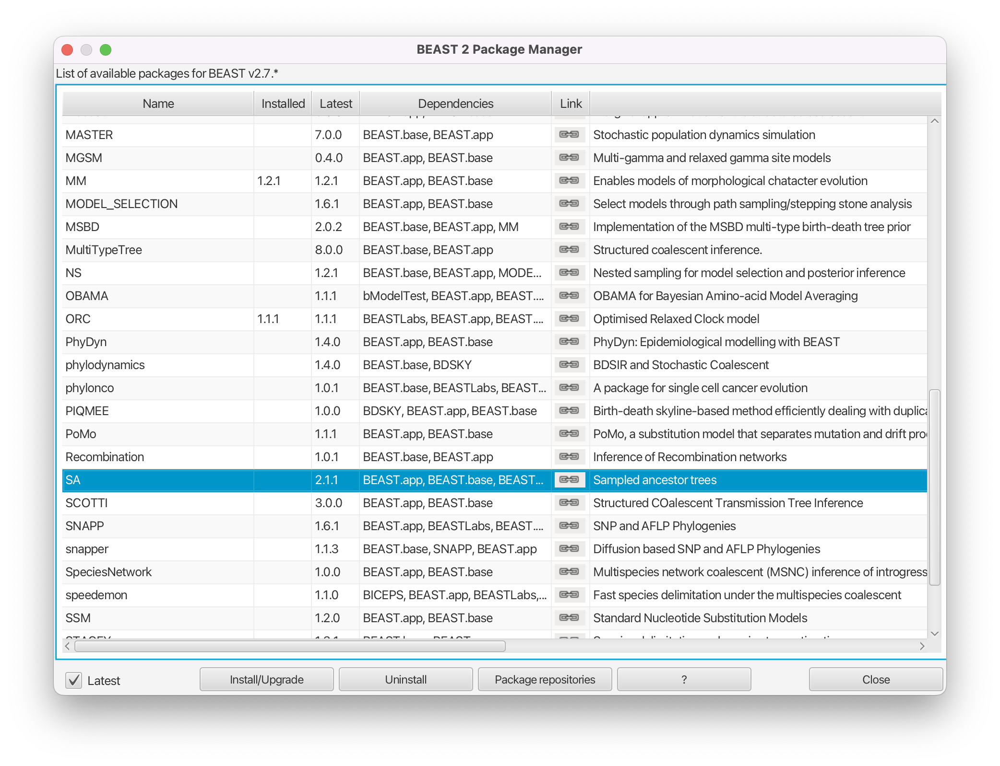
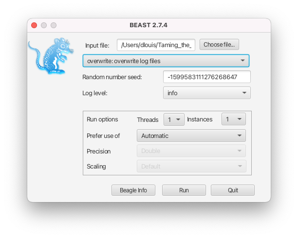
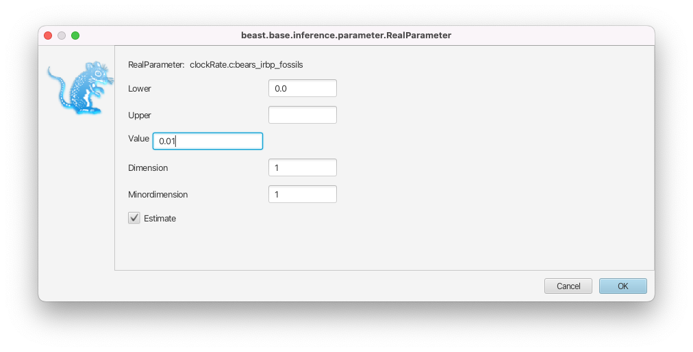
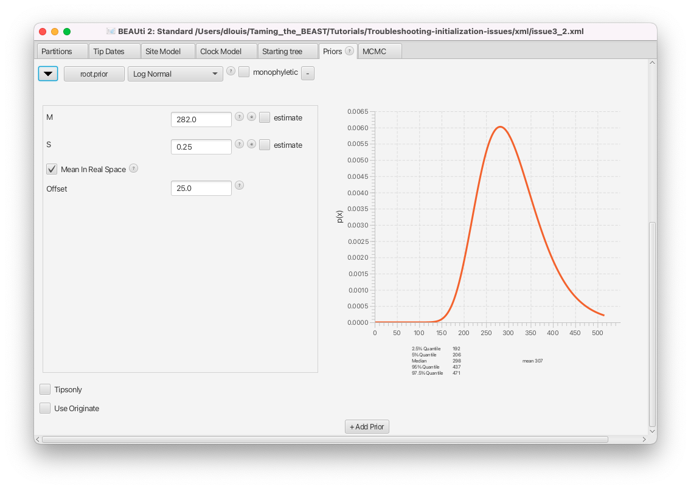
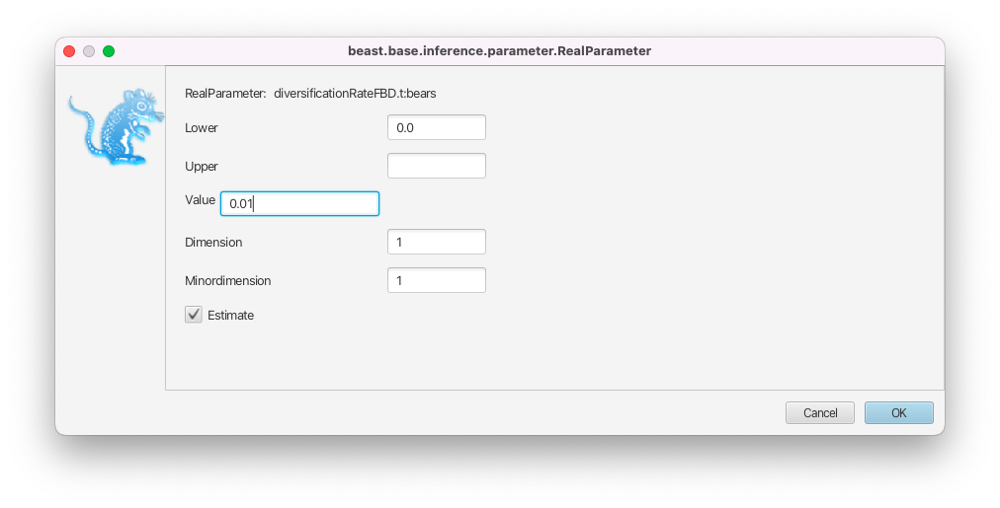

# Background

Many different problems can prevent a BEAST2 analysis from starting, from technical and file issues to incompatibilities in the model setup. Most analyses setup in BEAUti will run out-of-the-box, but as soon as you start tinkering with prior distributions and initial values the chance of running into an issue starts rising. This shouldn't act to discourage you from editing the default priors and initial values! You should **always** consider all priors and initial values and edit them if the default values don't make sense for your analysis. 

In this tutorial, we will show some examples of common issues and learn how to diagnose and fix them. Most of the initialization issues you are likely to encounter should be similar to one of the issues presented below. The more issues you encounter and fix the easier it will become to solve issues and get your BEAST analysis to start! 

----

# Programs used in this Exercise 

### BEAST2 - Bayesian Evolutionary Analysis Sampling Trees 2

BEAST2 ([http://www.beast2.org](http://www.beast2.org)) is a free software package for Bayesian evolutionary analysis of molecular sequences using MCMC and strictly oriented toward inference using rooted, time-measured phylogenetic trees. This tutorial is written for BEAST v{{ page.beastversion }} . 


### BEAUti2 - Bayesian Evolutionary Analysis Utility

BEAUti2 is a graphical user interface tool for generating BEAST2 XML configuration files.

Both BEAST2 and BEAUti2 are Java programs, which means that the exact same code runs on all platforms. For us it simply means that the interface will be the same on all platforms. The screenshots used in this tutorial are taken on a Mac OS X computer; however, both programs will have the same layout and functionality on both Windows and Linux. BEAUti2 is provided as a part of the BEAST2 package so you do not need to install it separately.


### Any programmer-friendly text editor

We will need to perform some manual edits on the XML files produced by BEAUti, for which we'll need a text editor. XML files can be opened by any text editor, but it's best to use one designed for programmers as these include nice features such as syntax highlighting, which makes the code more reader-friendly. [Sublime Text](https://www.sublimetext.com) is a good option which is available for MacOS, Windows and Linux. Other options include [Notepad++](https://notepad-plus-plus.org) (Windows), [Emacs](https://www.gnu.org/software/emacs/) (any platform) or [VSCode](https://code.visualstudio.com) (any platform). 

----

# Practical: Getting BEAST2 to start

## The Data

The data used in this tutorial is an alignment of genetic sequences for the interphotoreceptor retinoid-binding protein (irbp), and a morphological character matrix. Both alignments contain data for 8 extant and 14 fossil bear species. To illustrate different issues we have created several XML files using this dataset, each with a different initalization issue, available on the left-hand panel, under the heading **XML**.

 
## Packages

Examples in this tutorial require the **SA** (Sampled Ancestors) package to be installed.

> Launch **BEAUti**, then open the **BEAST2 Package Manager** by navigating to **File > Manage Packages** ([Figure 1](#packageManage1)).
> 

<figure>
	<a id="packageManage1"></a>
	
	<figcaption>Figure 1: Finding the BEAST2 Package Manager.</figcaption>
</figure>
<br>

The **SA** package may already be installed. Otherwise, install it by doing the following.

> Install the **SA** package by selecting it and clicking the **Install/Upgrade** button ([Figure 2](#packageSA)).
> 

<figure>
	<a id="packageSA"></a>
	
	<figcaption>Figure 2: Install the SA package.</figcaption>
</figure>
<br>

> Next, uninstall the **MM** package by selecting it and clicking the **Uninstall** button ([Figure 3](#packageMM)).
> 

<figure>
	<a id="packageMM"></a>
	
	<figcaption>Figure 3: Uninstalling the MM package.</figcaption>
</figure>
<br>

The reason for uninstalling the MM package will become clear later. If the MM package wasn't installed then clicking uninstall will have no effect.

BEAUti needs to be closed for the newly installed packages to be loaded properly.

> Close the **BEAST2 Package Manager** and **BEAUti**.
> 

<br>

## Common issue #1: Class could not be found

> Download the BEAST2 input file `issue1.xml`.
> 
> - Open **BEAST2** and select the file `issue1.xml` as input file. 
> - Start the run with the **Run** button. You should get an error message, as shown in [Figure 4](#errorPackage).
>

<figure>
	<a id="errorPackage"></a>
	
	<figcaption>Figure 4: The error message when running issue1.xml in BEAST2.</figcaption>
</figure>
<br>


This error means that BEAST2 could not identify one of the components of the analysis in the XML file. The error message shows which component is unidentified, in this example the class _morphmodels.evolution.substitutionmodel.LewisMK_, as well as the program's closest guess for what the component could be, here _beastlabs.inference.ML_. BEAST2 also shows you roughly where the reference to the missing component was found within the hierarchical structure of the XML file (here it is the substitution model, inside the site model, inside the tree likelihood, and so on). 


There are two main causes for this error:

- An error was introduced in the component name when editing the XML file manually. In this case, you simply need to edit the XML file to use the correct name.
- The BEAST2 package which contains this component is not installed. In this case, you need to identify which package is missing. If the file was produced by BEAUti, it should contain a list of required packages in the first line of the file. 

In this example, we have not edited the XML manually, so we conclude that we are missing a package. If we open the XML file in a text editor, we can see the list of required packages (separated by colons) in the XML header on the first line.

```xml 
required="BEAST.base v2.7.4:SA v2.1.1:MM v1.2.1" 
```

**BEAST.base** is always installed and we just installed **SA**. Thus we are missing the **MM** package which contains morphological substitution models (earlier we made sure that this package is uninstalled so that this XML file would not initialize). In fact, because the required packages are listed in the XML file, **BEAST2** also detected the missing package and reported it with the error message: _The following package is required, but is not available: MM v1.2.1_. 

However, keep in mind that if the XML file was manually edited then it is possible that not all required packages are listed in the XML header. In these cases you have to examine the missing component error to fix the issue. 

> Open `issue1.xml` in a text editor and remove the **MM** package from the requirements. Save the file and run it in **BEAST2**. 
>
> Did the error message change?
>

When the required packages are not listed in the XML file it can sometimes be tricky to figure out which package to install, because not all packages have self-explanatory names and the Java classpath of the missing component doesn't always contain the package name (as is the case here). In this case we can guess that the missing component (_morphmodels.evolution.substitutionmodel.LewisMK_) has something to do with morphological models. In the BEAST2 package manager there are short descriptions of each package on the right. For **MM** the description reads "Enables models of morphological character evolution." We can also click on the link icon to be taken to the code repository for the **MM** package, where we can easily verify that _morphmodels.evolution.substitutionmodel.LewisMK_ is indeed included in it (within the `src/` directory). 

There are still times when this strategy won't work (the package is messy, contains many different types of models, or the package may not even be available on the default BEAST2 package repository). In such cases you can try examining the source of the XML file (e.g. a tutorial or a publication) or simply do an online search for the name of the missing component. For instance, the **MM** package repository is one of the top results in a Google search for _morphmodels.evolution.substitutionmodel.LewisMK_.


> Following the same process as for the **SA** package, open the **BEAST2 Package Manager** in **BEAUti** and install the **MM** package.
> 
> Close and reopen **BEAST2** and run the file `issue1.xml` again, checking that it now initializes and runs.
>


<br>


## Common issue #2: Output files already exist

> Download the BEAST2 input file `issue2.xml` in the same folder as `issue`1`.xml`.
>
> - Open **BEAST2** and select the file `issue2.xml` as input file. 
> - Start the run with the **Run** button. You should get an error message, as shown in [Figure 5](#errorOverwrite).
>

<figure>
	<a id="errorOverwrite"></a>
	
	<figcaption>Figure 5: Another error message in BEAST2, this time for issue2.xml.</figcaption>
</figure>
<br>

This error means that BEAST2 is attempting to overwrite a `.log` or `.tree` file that already exists, as explained in the message _Trying to write file bears.log but the file already exists_. By default, overwriting files is not permitted in order to avoid accidentally losing data. If **BEAST2** is run in interactive mode from the command line, for instance on your local machine, it offers you the possibility to continue the analysis, by typing **Y** to overwrite the files. However, if **BEAST2** is run on a computing cluster, it will simply stop when encountering this issue.

To solve this problem, there are three possibilities:

- If the intention is to overwrite the existing files, select the **overwrite** option from the dropdown menu in the **BEAST2** launcher (see [Figure 6](#overwrite)) or use the **-overwrite** option in the command-line interface.

<figure>
	<a id="overwrite"></a>
	
	<figcaption>Figure 6: BEAST2 launcher with the overwrite option selected.</figcaption>
</figure>
<br>

- If the intention is to resume a run, i.e. to append to the existing files, select the **resume** option from the dropdown menu in the **BEAST2** launcher (see [Figure 7](#resume)) or use the **-resume** option in the command-line interface.

<figure>
	<a id="resume"></a>
	
	<figcaption>Figure 7: BEAST2 launcher with resume option selected.</figcaption>
</figure>
<br>

- If you would like to create new files, either move the original files, move the XML file, or change the names of the `.log` and `.tree` files in the new analysis.

> Open **BEAUti** and load the file `issue2.xml`.
> - In the **MCMC** panel, expand the options for the **tracelog** by clicking on the arrow to the left. Change the **File Name** to `bears_longer.log`.
> - Do the same for the **treelog** and change the **File Name** to `bears_longer.trees`.
> - Save the file `issue2.xml`. Run it in **BEAST2** again, and check that it now works.
>

**This issue may seem simple and straightforward, but it has been the cause of countless hours of delays and lost computing time!**

To make your life easier and avoid accidentally overwriting output files you can use the variables `$(filebase)`, `$(seed)` and `$(tree)` in the names for the `.log` and `.tree` files. When you run the analysis `$(filebase)` will be replaced by the name of the XML file (without the `.xml` extension), and `$(seed)` by the random number seed (useful for reproducing exactly the same analysis). The `$(tree)` variable can be used to label different `.tree` files when an analysis contains more than one tree. Since BEAST 2.7 the default `.log` filename is `$(filebase).log` and the default `.tree` file name is `$(filebase)-$(tree).trees`. 


<br>

## Common issue #3: Could not find a proper state to initialize


### Troubleshooting a simple parameter issue

> Download the BEAST input file `issue3a.xml`.
>
> - Open **BEAST2** and select the file `issue3a.xml` as input file. 
> - Start the run with the **Run** button.
>
> You should get an error message, as shown in [Figure 8](#errorStarting).
> 

<figure>
	<a id="errorStarting"></a>
	
	<figcaption>Figure 8: Yet another error message in BEAST2, this time for issue3a.xml.</figcaption>
</figure>
<br>

The inference failed to start because a good initial state could not be found, as explained by the error message (_Could not find a proper state to initialise. Perhaps try another seed_). This issue is much more complex to diagnose than the previous ones, as it can be caused by many different parts of the analysis configuration. The suggestion to try another seed is not a very good one and we will come back to it in the **"Number of initialization attempts"** section below. 

Above the error message BEAST2 traces through its attempt to calculate an initial value for the posterior. We can use this trace to figure out which model component is responsible for the issue. Remember that the posterior is given by Bayes' formula,



where  is a vector of all the model parameters and  is the data, here consisting of the genetic data,  and the morphological data, . In the equation above  is the likelihood and  the prior. 

In our model we are estimating the following parameters:

- Tree, 
- Fossilized birth-death (FBD) model:
	- Diversification rate,  
	- Turnover, 
	- Sampling proportion, 
	- Origin time, 
- HKY nucleotide substitution model:
	- Transition/transversion ratio,  
	- Nucleotide equilibrium frequencies, 
- Lewis MK morphological trait substitution model:
	- Relative mutation rate, 
- Strict clock models:
	- Nucleotide substitution rate, 
	- Morphological trait substitution rate, 

Thus, we can write the posterior as, 



We assume that the genetic and morphological likelihoods are independent and that all of the other model parameters are independent of each other (except for the tree, which is generated by the FBD parameters), so we can factorise the likelihood and the prior. We also don't need to calculate  when using MCMC to estimate posterior distributions, so what BEAST2 actually calculates is, 



In this nasty expression  is the tree prior (here the fossilized birth-death model), which is the only part of the prior that depends on other parameters. You can find all the model parameters by loading the XML file into BEAUti, or by locating the `<state>` section in the XML file.

For computational reasons BEAST2 calculates log probabilities, which means values of  correspond to prior or model probabilities of 0. When initialising, BEAST2 attempts to calculate . To do so, it recursively attempts to calculate all of the parts of the posterior, until it reaches a density that can be evaluated without calculating anything else. Thus it firsts calculates all the parameter priors (because they don't depend on anything else), then the tree prior (which depends on some parameters), then the likelihoods and finally the posterior. To find the root of the problem we have to trace through our posterior calculation and find the component furthest downstream with a value of . When tracing through the error message above we see three parts of the model returned  :

- _P(posterior) = -Infinity (was -Infinity)_
- _P(prior) = -Infinity (was -Infinity)_
- _P(ClockPrior.c:bears_irbp_fossils) = -Infinity (was -Infinity)_

The likelihoods returned _NaN_ (not a number), which means BEAST2 crashed before they could be calculated (BEAST2 stops as soon as a model component returns ). Thus, we can conclude that the model most likely failed when calculating the prior of the clock rate of the genetic alignment,  above. 

To inspect the parameter and find the issue, we will first load the file into BEAUti.

> Open **BEAUti** and load in the `issue3a.xml` file by navigating to **File > Load**.
> 
> - Switch to the **Priors** panel.
> - Click on the arrow left of the **clockRate.c:bears_irbp_fossils** to see the details of this prior ([Figure 9](#clockRatePrior)).
>

<figure>
	<a id="clockRatePrior"></a>
	
	<figcaption>Figure 9: Details of the genetic clock rate prior.</figcaption>
</figure>
<br>

We can see that the clock rate prior was changed from the default, which is a uniform distribution between 0 and infinity, to a uniform distribution between 0 and 0.5. In general, changing this default prior is a good idea, as the default is extremely vague, places far too much weight on very large and unrealistic values and is thus not an accurate description of our prior knowledge. 

Whenever we change a prior distribution from the default and especially when setting priors with hard bounds (e.g. a uniform or Beta distribution),  we need to make sure that the initial value of the parameter still falls within the bounds of the distribution. For each parameter, the initial value is shown in the box to the right, as **initial = [x] [min, max]**. Here _x_ indicates the initial value and _min_ and _max_ the range of possible values for the corresponding parameter.

> Check the initial value of the **clockRate.c:bears_irbp_fossils** parameter in the box to the right of the parameter.
> We can see that the box reads **initial = [1.0]**.
>

The initial value of the clock rate is set to **1.0**, which is outside the bounds of the prior for this parameter. This is why the initialization failed.

> In the **Priors** panel, click on the **initial = [1.0]** box right of the **clockRate.c:bears_irbp_fossils** parameter.
>
> - Change the initial value in the **Value** box to **0.01** ([Figure 10](#initialClock)).
> - Click on **OK** to close the box.
> - Save the updated configuration as `issue3a_fixed.xml` by navigating to **File > Save As**.>
> - Open **BEAST2** and select `issue3a_fixed.xml` as the input file.
> - Start the run with the **Run** button. It works now!
>

<figure>
	<a id="initialClock"></a>
	
	<figcaption>Figure 10: Changing the initial value of the clock rate.</figcaption>
</figure>
<br>

Using this procedure to trace through the calculation of the posterior you can always identify which model component is causing an initialization issue. Usually simple issues like initial values are the cause, but there are times when things are more complex.


> **Topic for discussion**
> 
> In the XML file `issue3a.xml`, is there a prior for the relative mutation rate in the Lewis MK model, ? 
>
> It is not shown in the initialization trace [Figure 8](#errorStarting), which means no explicit prior was set for this parameter. 
> Is this a problem? If no prior distribution is set in the XML file, what prior is used for the parameter? 
> 
> <details>
	<summary>Answer</summary>
> 
> If no prior is set for a parameter the implicit prior becomes a uniform distribution between the parameter bounds. In the case of the mutation rate (called <i>mutationRate.s:bears_morphology2</i> in the XML file), no bounds are set either, so it inherits the default bounds of a real parameter in BEAST2, which is between negative and positive infinity. 
> <br><br>
> In this case it doesn't make any difference. Although the parameter is estimated, the Delta exchange operator on it parameter constrains it to be always equal to one (it would probably have made more sense to just fix the parameter though). 
> <br><br>
> In general though, an unbounded uniform prior is a bad idea for most parameters for exactly the same reasons it is a bad choice for the clock rate. 
> More importantly, "hidden" priors like these are a problem when doing model selection. An unbounded uniform prior is an improper prior (there exists no normalising constant that can make it integrate to 1, so it integrates to infinity). Improper priors can cause issues with model selection if the posterior then also integrates to infinity. In general it's impossible to know if using an improper prior will lead to a proper posterior, so it is recommended to not use improper priors (we can only know if the posterior is proper if we can analytically integrate it, which is usually not the case for BEAST models). It is always possible to set some sensible parameter bounds, so we can always make all of our priors proper. 
> <br><br>
> Finding out if there are "hidden" priors in your model is more complex, especially when the BEAUti template for a model doesn't explicitly initialize priors for all model parameters. You can navigate to the <b>Initialization</b> panel in BEAUti (click <b>View > Show Initialization panel</b> to display it) to check if all model parameters also have prior distributions set (by comparing with the <b>Priors</b> panel), but it is unfortunately not possible to add a missing prior from BEAUti. If you've identified such a model parameter then you would need to add the prior by manually editing the XML file. It is also a good idea to contact the package developers, so they can address the issue in future releases.
>
> </details>
>


<br>

### Troubleshooting incompatibilities between model components

In the example above the incompatibility was just within one parameter that was out of the bounds of its prior. When one model parameter appears in multiple model components, incompatibilities between different model components can lead to the posterior evaluating to negative infinity. This most often involves the tree, which appears in many model components. If, in addition, MRCA priors with hard bounds or offsets are set, or the starting tree is fixed, the probability for an incompatibility is much higher. 

One particular example occurs with birth-death models where the origin parameter is estimated (such as the BDSKY, BDMM or FBD models). 

> Download the BEAST2 input file `issue3b.xml`.
> 
> - Open **BEAST2** and select the file `issue3b.xml` as input file. 
> - Start the run with the **Run** button. You should get an error message, as shown in [Figure 11](#errorOrigin).
>

<figure>
	<a id="errorOrigin"></a>
	
	<figcaption>Figure 11: The return of the error message (issue3b.xml).</figcaption>
</figure>
<br>

While this is a validation issue, the error message is different to the example above. Here the message (_Initial value of origin (100.0) should be greater than initial root height (125.1)_) indicates clearly what is going on: we have specified an origin parameter with an initial value which is incompatible with the initial tree (by definition the origin should be larger than the height of the tree). 

Unfortunately, while it is straightforward to create an XML file with this error in BEAUti, it cannot be loaded into BEAUti again for editing (give it a try). This is because BEAUti does more than simply write XML code to files. While editing the XML file, BEAUti also instantiates the model (using the same code that BEAST2 uses to run the model). This is done to ensure that BEAUti only produces XML files containing BEAST2 analyses with the correct syntax. Similarly, when loading an XML file into BEAUti, the model is instantiated. If doing so returns any errors, BEAUti cannot load the XML file. This would be the case if, for example the XML file contains syntax errors, or it refers to classes in packages that are not installed. In this particular case, the FBD model checks that the initial value of the origin parameter is greater than the height of the starting tree. Since this is not the case here, the model throws an error and BEAUti fails to load the XML file. To correct this error we can either recreate the whole XML file from scratch in BEAUti, or quickly edit it in a text editor.

> Open the `issue3b.xml` file in a text editor.
> - Look for the parameter **originFBD.t:bears** and examine its initial value.
> - Look for the root prior **root.prior** and examine its distribution. Look in particular at the values for the **offset**, **M** and **S** parameters.
>

The origin parameter configuration is:
```xml
<parameter id="originFBD.t:bears" spec="parameter.RealParameter" lower="0.0" name="stateNode">100.0</parameter>
```
And the root prior distribution is set up like this:
```xml
<LogNormal id="LogNormalDistributionModel.9" name="distr" offset="125.0">                                 
     <parameter id="RealParameter.92" spec="parameter.RealParameter" estimate="false" name="M">2.0</parameter>
     <parameter id="RealParameter.93" spec="parameter.RealParameter" estimate="false" lower="0.0" name="S" upper="5.0">0.5</parameter>
</LogNormal>
```

We can see that the distribution for the root prior has an offset of **125.0**, meaning that the root of the tree will always be greater than this value. However the initial value of the origin parameter was left to the default, which is **100.0**. This is the source of the error reported by **BEAST2**. Thus we need to change the value of the origin to be compatible with our starting tree.

> - In the text editor, look for the parameter **originFBD.t:bears** and change its initial value from **100.0** to **150.00**.
> - Save the updated configuration as `issue3b_fixed.xml`.
> - Open **BEAST2** and select `issue3b_fixed.xml` as the input file.
> - Start the run with the **Run** button. It works now!
>

Here the incompatibility stemmed from us setting a root prior with an offset. However, this issue can also happen when using a user-specified starting tree, for instance a tree from a Newick string. In this case the origin parameter needs to be compatible with the specified tree, i.e. the initial value of the origin needs to be higher than the root of the Newick tree. Finally, it is also entirely possible for this issue to occur even when using a default randomly initialized tree. 

Some other common cases where inconsistencies between model components can lead to initialization failures are:

- Setting multiple (reciprocally incompatible) MRCA priors on different nodes in the tree.
- Setting monophyly constraints on the tree and supplying a starting tree incompatible with these constraints.
- When an initial tree is specified for a structured analysis that is incompatible with the initial parameter values of the migration model.
- When the initial values for rates are set to 0, for instance setting the initial value of the sampling rate (of a birth-death model) to 0 means that it is impossible to have observed any samples, so every tree has a probability of 0 under the model.

Some more common model incompatibilities are also listed [here](http://www.beast2.org/2018/07/04/fatal-errors.html).

<br>

### Troubleshooting a complex parameter issue

> Download the BEAST input file `issue3c.xml`.
>
> - Open **BEAST2** and select the file `issue3c.xml` as input file. 
> - Start the run with the **Run** button. You should get an error message, as shown in [Figure 12](#errorStarting2).
> 

<figure>
	<a id="errorStarting2"></a>
	
	<figcaption>Figure 12: A similar error message as earlier (issue3c.xml).</figcaption>
</figure>
<br>

As before, **BEAST2** could not find a valid state to start the inference. This time there are finite values for all of the simple parameter priors, meaning that all of the initial values fall within the prior bounds. The two exceptions are the FBD tree prior, which reads _P(FBD.t:bears) = -Infinity_ and an MRCA prior on the root of the tree, which reads _P(root.prior) = NaN_, meaning it was not evaluated before BEAST2 crashed. Thus, we can conclude that the issue likely has something to do with the calculation of the FBD density. The FBD prior is a tree prior, and depends on the tree as well as several other parameters, so there are several possible causes for the issue:

-  **An issue with the initial tree:** the inference will not start if the initial tree is impossible under the specified tree model or MRCA constraints. By default, most analyses use a simple coalescent model to simulate a random initial tree that respects all MRCA constraints. However, with more complex models, or incompatible MRCA priors, the simulation process can fail to find a good tree. Similarly, when there are additional constraints on the tree that are not encoded in MRCA priors (as with the origin parameter in the example above), the simulated tree can also be incompatible. In such cases the simulation either needs to be fine-tuned to satisfy the constraints, or a valid initial tree should be provided to the analysis. 
-  **An issue with the initial parameter values:** if the initial values set in the analysis are very far from plausible, the resulting density of the model will be extremely small. Because of the limitations of floating point arithmetic used by computers, numbers with very large magnitudes get approximated to positive or negative infinity and numbers with very small magnitudes to zero. That means for very improbable parameter combinations, the density of a model, . Usually, calculations are done in logspace to alleviate this effect, however for extremely unlikely parameter combinations we will have . Most of the parametric prior distributions available in BEAST2 only tend to 0 as the parameter tends to infinity, making it very unlikely to encounter numerical underflow issues with these distributions. However, more complex distributions, like tree priors, have complex, high-dimensional density landscapes and it is entirely possible that a parameter combination that works for one model evaluates to negative infinity for a related model. 
-  **A bug in the density calculation:** BEAST2 packages can contain calculation issues which have remained undetected so far (especially if they only appear under very specific circumstances). Such bugs should be reported to the package developers. However, this is unlikely in our case, as the FBD model has been extensively tested and used in the past, and our analysis setup is similar to previous analyses.

To inspect the initial values and find the issue, we will first load the file into BEAUti.

> Open **BEAUti** and load in the `issue3c.xml` file by navigating to **File > Load**.
> 

The starting tree can be found in the **Starting tree** panel, which is hidden by default.

> Open the **Starting tree** panel by navigating to **View > Show Starting tree panel**.
> Switch to the **Starting tree** panel.
>

<figure>
	<a id="startingTree"></a>
	
	<figcaption>Figure 13: Starting tree panel.</figcaption>
</figure>
<br>

As we can see in [Figure 13](#startingTree), the initial tree in this analysis is set to a Newick tree, chosen by the user. The **Newick** box gives the full Newick string, which we could use to inspect the tree in an other program. This string can also be copied directly from the XML file. First, we will check if this tree is compatible with the tree constraints set in the **Priors** panel.

> Switch to the **Priors** panel.
> Click on the arrow left of the **root.prior** to see the details of this prior ([Figure 14](#rootPrior)).
>

<figure>
	<a id="rootPrior"></a>
	
	<figcaption>Figure 14: Priors panel showing the root prior.</figcaption>
</figure>
<br>

The only constraint set on the tree is a prior on the age of the root, which we can see in the **Priors** panel. By checking the details, we can see that this is a wide lognormal prior, with the 5% quantile of the prior at **206 Ma** and the 95% quantile at **437 Ma** (in this analysis branch lengths are in millions of years). Normally, a single lognormal MRCA prior will not be incompatible with any tree, since it is defined across all positive real numbers and only approaches 0 for parameter values approaching infinity. However, this particular prior also has an offset of **25 Ma** set. That means any tree with a root height less than 25 Ma will be incompatible with this prior. 

Let's import our starting tree in Icytree to check if the root age is compatible with the prior.

> Open Icytree ([https://icytree.org/](https://icytree.org/)) in a web browser.
>
> - Copy the Newick string from the **Starting tree** panel or from the XML file.
> - In the IcyTree browser window click **File > Enter tree directly**.
> - Paste the copied Newick string and press **Done** to display the tree in IcyTree. 
>

By hovering over the root node of the starting tree, we can see that its age is set to **417.2 Ma**, which is consistent with the root prior set in the analysis. 

Next, we will inspect the initial values of the parameters of the FBD model, found in the **Priors** panel in **BEAUti**. The FBD model has 3 parameters: the diversification rate, the turnover and the sampling proportion. We can see that the initial diversification rate is **1.0**, the initial sampling proportion **0.5** and the initial turnover **0.5**. These are the default values of these parameters, but they may not be adapted to all datasets. In particular, a diversification rate of 1.0/My is a very high value - since our starting tree is more than 400 My old, it means that we would expect about  extant species (as opposed to the 8 extant bears we actually have). Having a very implausible starting value for the diversification rate could explain the failure we observed earlier when calculating the likelihood of the FBD model, so we will change it to a more realistic value of **0.01**. This leads to the much more reasonable , still more than observed, but not so unlikely that the log density would evaluate to negative infinity.


> In the **Priors** panel, click on the **initial = [1.0]** box right of the **diversificationRateFBD** parameter.
> 
> - Change the initial value in the **Value** box to **0.01** and click on **OK** to close the box ([Figure 15](#initialDiv)).
> - Save the updated configuration as `issue3c_fixed.xml` by navigating to **File > Save As**.
> - Open **BEAST2** and select `issue3c_fixed.xml` as the input file.
> - Start the run with the **Run** button. It works now!
>

<figure>
	<a id="initialDiv"></a>
	
	<figcaption>Figure 15: Changing the initial value of the diversification rate.</figcaption>
</figure>
<br>


> **Topic for discussion**
>
> We investigated three model components in the example above, the MRCA prior, the initial tree and the FBD tree prior.
>
> We finally found that the initial parameter combination of the FBD tree prior was very unlikely, specifically the diversification rate was incompatible with the tree height. If we had not specified an MRCA prior or an initial tree, would we still have encountered the initialization error? 
>  
> Try removing the MRCA prior and changing the initial tree back to a randomly simulated tree in BEAUti to investigate this question! 
>


### Using a different seed or increasing the number of initialization attempts

If there are no obvious incompatibilities in the analysis setup, it is possible that the problem is simply due to bad luck rather than a fundamental problem with the setup. During initialization some model components are randomly initialized. In a standard analysis this is just the starting tree, but could also be other model components, depending on the models and packages used. It is possible that the random starting tree is just extremely unlikely under the model configuration and causes initialization to fail. This is rare, but it can happen with complex configurations or with packages and models that are still under development. 

For randomly initialized model components the random number seed is very important and if a specific seed was used to run the analysis then changing it may indeed help, as suggested by BEAST2 ([Figure 8](#errorStarting)). However, if no seed is provided to BEAST2 then the seed is itself random and a different seed is used each time the analysis is attempted. 


To save time rerunning the same analysis with many different seeds, BEAST2 by default tries to initialize an analysis **10** times before giving up, but it is possible to increase the number of attempts.

> Open **BEAUti** and load in the `issue3b.xml` file by navigating to **File > Load**.
> 
> - Switch to the **MCMC** tab.
> - The number of initialization attempts is controlled by the **Num Initialization Attempts** setting, shown in [Figure 16](#numInit).
>

<figure>
	<a id="numInit"></a>
	
	<figcaption>Figure 16: Setting the number of initialization attempts.</figcaption>
</figure>
<br>

Note that changing this setting will never help if the analysis contains incompatibilities (or any of the other issues above). In the case of the `issue3a.xml` file, for instance, the starting value of the clock rate is outside of the bounds of the corresponding prior, so initialization will always fail regardless of how many attempts are performed. Similarly, if no model components are randomly initialised (e.g. a fixed starting tree is used) and there is an initialization issue, then no number of initalization attempts will solve the issue.

> **Topic for discussion**
>
> If no model components are randomly initialised does the random number seed still have an effect on the analysis? 
> 
> <details>
	<summary>Answer</summary>
> 
> Yes, it still makes a difference! Although each analysis will start from the exact same point in the posterior landscape, the random number seed is important for initializing the operators, used to make proposals in the MCMC run. Thus, each random number seed will result in a unique trajectory followed across the posterior. However, it is a good idea to initialize at least some model components randomly, as always starting with the same initial values can mean we get stuck in a local optimum. (Keep in mind that in the case of large trees a random initial tree will take extremely long to burn in and for pragmatic reasons a "good" initial tree is often used).
> </details>
>

<br>


## Common issue #4: Validation error when parsing XML file

> Download the BEAST input file `issue4.xml` and `issue4_working.xml`.
> 
> - Open **BEAST2** and select the file `issue4.xml` as input file. 
> - Start the run with the **Run** button. You should get an error message, as shown in [Figure 17](#errorParsing).
>

<figure>
	<a id="errorParsing"></a>
	
	<figcaption>Figure 17: The revenge of the return of the error message (issue4.xml).</figcaption>
</figure>
<br>

Here the run failed to start because the XML file could not be parsed, as explained by the error message _Error 110 parsing the xml input file_. Thankfully the error message tells us exactly where the error happened (_\<log id='ORCRatesStat.c:bears_morphology' spec='beast.base.evolution.RateStatistic'>_) and what the issue is (_Input 'tree' must be specified._). If we open the `issue4.xml` file and look for **ORCRatesStat.c:bears_morphology**, we can see that line 771 corresponds to the error message and reads as follows:

```xml
<log id="ORCRatesStat.c:bears_morphology" spec="beast.base.evolution.RateStatistic" branchratemodel="@OptimisedRelaxedClock.c:bears_morphology"/>
```
By comparing to a previous (working) analysis in the file `issue4_working.xml`, we can see that the correct configuration should be (line 733):
```xml
<log id="ORCRatesStat.c:bears_morphology" spec="beast.base.evolution.RateStatistic" branchratemodel="@OptimisedRelaxedClock.c:bears_morphology" tree="@Tree.t:bears"/>
```
As the error message told us, the **tree** element of the configuration is missing in the non-working XML file, so we need to add it back in.

> Open the file `issue4.xml` in a text editor.
> 
> - Modify **line 771** of the file to add the `tree="@Tree.t:bears"` element. Save the file as `issue4_fixed.xml`.
> - Open **BEAST2** and select the file `issue4_fixed.xml` as input file. 
> - Start the run with the **Run** button. Now it works!
>

XML parsing errors usually occur when the XML file has been manually edited and parts of the configuration have been accidentally deleted or modified. This is why it's important to always keep a copy of the original XML file or use version control when making manual edits, as this provides an easy way to compare edits to a working configuration. Loading, saving and re-loading complex configurations into BEAUti repeatedly can also lead to parsing issues, although if this happens it is a bug and should be reported to the package developers (for instance by opening an issue on the package repository, findable in the BEAST2 package manager). In general, if an XML parsing error occurs in a file which was generated entirely through BEAUti, then this bug should be reported to the package developers.

### Debugging BEAST2 XML (optional)

Unless you know your way around the BEAST2 source code it can be difficult to know how to manually edit the components in an XML file. In the example above, we already had a previous, working analysis and could use that to debug the issue. But if we didn't have it, it may have taken us much longer to figure out how to specify the tree for the rate statistic component. 

Fortunately, all of the components are documented in the BEAST2 XML manual at [http://www.beast2.org/xml/index.html](http://www.beast2.org/xml/index.html). If we search for `RateStatistic` in the left-hand panel, we see that `tree` is a required input ([Figure 18](#beastdoc)). 

<figure>
	<a id="beastdoc"></a>
	
	<figcaption>Figure 18: The XML documentation for rate statistic.</figcaption>
</figure>
<br>

However, there is a problem. The online manual is for BEAST v2.6.7 and may be outdated for some components. More importantly, the online documentation only contains components in the BEAST2 core and nothing in any of the packages we installed. Luckily we can easily generate the documenation for the version of BEAST2 and all packages we have installed using the **DocMaker** utility, which comes with BEAST2. 

> Open a terminal and navigate to the directory where you want to save the BEAST2 XML manual
> 
> - Type `<beast2 path>/bin/applauncher DocMaker .` where `<beast 2 path>` should be replaced with the directory where BEAST2 is installed.
> - Now open the newly generated `index.html` in any browser.
>
> This is also documented [here](http://www.beast2.org/2023/06/01/docmaker.html)

The generated documentation should be for the version of BEAST2 that is installed and contain XML documentation for all packages that are installed. Note that while this documentation is extremely useful, it can still be very sparse for most components since most developers don't invest a lot of time in documentation. Most BEAST2 packages come with some example XML files and these can also be very useful for figuring out how to specify models that cannot be specified in BEAUti. You can locate the directory where a package (and its example XML files) is installed from BEAUti by navigating to **File > Set working dir** and selecting a package. If you then try to open a file BEAUti will open in the directory where that package is installed. 


## Error messages not covered in this tutorial

Many different issues can occur in **BEAST2**, and it is impossible to cover them all in this tutorial. However, one important thing to keep in mind is that **BEAST2** will always attempt to provide some information on the issue it has encountered. Thus it is critical to carefully read the error messages, as in all of the examples in this tutorial. While the error messages may not always be very insightful, they usually contain enough information to solve most common issues. 

For the issues that cannot be easily debugged it is recommended to contact the package developers, or to make a post on [http://groups.google.com/group/beast-users](http://groups.google.com/group/beast-users). If it is a common issue it is likely that someone else has encountered it before you! 

In the rare case where BEAST2 initializes an analysis without any problems and then subsequently crashes it is likely that there are issues with the code (contact the developers) or with your setup (try running it on a different machine). 

----

# Acknowledgment

The complex parameter issue example in this tutorial was inspired by a real issue encountered during the analysis of the convergent evolution of true crabs .


# Useful Links

- [Bayesian Evolutionary Analysis with BEAST 2](http://www.beast2.org/book.html) 
- BEAST 2 website and documentation: [http://www.beast2.org/](http://www.beast2.org/)
- BEAST 1 website and documentation: [http://beast.bio.ed.ac.uk](http://beast.bio.ed.ac.uk)
- Join the BEAST user discussion: [http://groups.google.com/group/beast-users](http://groups.google.com/group/beast-users) 
- [BEAST 2 XML documentation](http://www.beast2.org/xml/index.html) and how to compile it for your own setup: [http://www.beast2.org/2023/06/01/docmaker.html](http://www.beast2.org/2023/06/01/docmaker.html)
- Some common reasons why BEAST 2 may fail to find a valid initial state: [http://www.beast2.org/2018/07/04/fatal-errors.html](http://www.beast2.org/2018/07/04/fatal-errors.html)

----

# Relevant References




